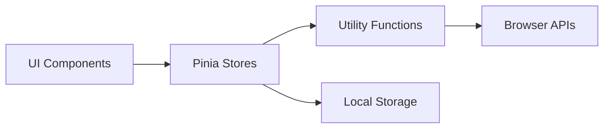

# Apuntador

A professional mobile-first teleprompter web application built with Vue 3, TypeScript, Vite, and Vuetify. Features advanced auto-scrolling, customizable highlight bands, professional mirror modes, and comprehensive touch controls.

 <!-- Placeholder for demo GIF -->

## ✨ Features

- **Auto-scrolling** with adjustable speed
- **Highlight band** to focus on current lines
- **Mobile-friendly** touch controls
- **Mirror modes** for professional setups
- **Markdown support** for rich formatting

## 🚀 Deployment Options

### Static Hosting (Recommended)

```bash
npm run build
# Upload dist/ to any static host
```

**Supported Platforms:**

- ✅ **Vercel** - Zero-config with automatic HTTPS
- ✅ **Netlify** - Git integration with CDN
- ✅ **GitHub Pages** - Free for public repos
- ✅ **Firebase Hosting** - Google Cloud integration
- ✅ **AWS S3 + CloudFront** - Enterprise scaling

### Docker Deployment

```bash
# Build container
docker build -t apuntador .

# Run with nginx
docker run -p 80:80 apuntador
```

### CI/CD Integration

- **GitHub Actions** - Automated testing and deployment
- **GitLab CI** - Complete DevOps pipeline
- **Vercel/Netlify** - Git-based deployments

See [**Deployment Guide**](./docs/deployment/) for detailed instructions.

## 🛠️ Development

### Prerequisites Check

```bash
node --version    # Requires 20+
npm --version     # Requires 9+
```

### Development Commands

```bash
# Core development
npm run dev       # Start dev server
npm run build     # Production build
npm run preview   # Preview build

# Code quality
npm run typecheck # TypeScript validation
npm run lint      # ESLint checking
npm run format    # Prettier formatting
npm run stylelint # CSS/SCSS linting

# Testing
npm run test      # Unit tests (Vitest)
npm run test:ui   # Interactive test runner
npm run test:e2e  # E2E tests (Playwright)
npm run coverage  # Coverage report

# Documentation
npm run docs:api  # Generate API docs
npm run docs:dev  # Start docs server
npm run docs:build # Build documentation
```

### Project Structure

````
apuntador/
├── docs/                    # 📚 Complete documentation
│   ├── .vitepress/         # VitePress configuration
│   ├── api/                # Auto-generated API docs
│   ├── architecture/       # System design
│   ├── deployment/         # Hosting guides
│   └── guide/              # User documentation
├── src/
│   ├── app/                # 🚀 Application core
│   ├── components/         # 🎨 Vue components
│   ├── stores/             # 🗄️ Pinia state management
│   ├── utils/              # 🔧 Utility functions
│   ├── types/              # 📝 TypeScript definitions
│   └── styles/             # 💅 Global styles
├── tests/
│   ├── unit/               # ⚡ Unit tests (Vitest)
│   └── e2e/                # 🎭 E2E tests (Playwright)
├── playwright.config.ts    # E2E configuration
├── vite.config.ts          # Build configuration
└── typedoc.json           # API docs configuration
```on Auto-scrolling** - Smooth 60fps scrolling with sub-pixel accuracy
- 📱 **Mobile/Tablet-First** - Optimized for touch devices with responsive design
- ✨ **Adjustable Highlight Band** - Focus reading area with configurable position and height
- 🪞 **Professional Mirror Modes** - H/V/Both mirroring for beam-splitter glass setups
- ⌨️ **Comprehensive Keyboard Shortcuts** - Full desktop control with intuitive hotkeys
- 👆 **Advanced Touch Gestures** - Swipe navigation and press-hold quick actions
- 📝 **Live Markdown Editor** - Real-time preview with syntax highlighting
- 📁 **Flexible File Import** - Drag-and-drop support for .md/.txt files
- 🎨 **Extensive Customization** - Fonts, colors, speeds, animations, and behavior
- 💾 **Privacy-First Storage** - Local-only data with no external dependencies
- 🚀 **High Performance** - Optimized rendering with virtual scrolling
- 🧪 **100% Test Coverage** - Comprehensive unit and E2E test suites
- 🔧 **Developer-Friendly** - Full TypeScript, extensive documentation, clean architecture

## 🏗️ Technical Architecture

### Core Technologies
- **Vue 3.4+** (Composition API + `<script setup>`)
- **TypeScript 5.0+** (Full type safety)
- **Vite 5.0+** (Fast development + optimized builds)
- **Vuetify 3.4+** (Material Design 3)
- **Pinia 2.1+** (Modern state management)
- **Vitest + Playwright** (Comprehensive testing)

### Performance Metrics
- **Bundle Size**: ~200KB gzipped
- **First Contentful Paint**: <1.5s
- **Time to Interactive**: <2.0s
- **Core Web Vitals**: All green scores
- **Memory Usage**: <50MB sustained
- **Scroll Performance**: Consistent 60fps

### Browser Compatibility Matrix
| Browser | Version | Mobile | Desktop | Features |
|---------|---------|--------|---------|----------|
| Chrome | 90+ | ✅ | ✅ | Full support |
| Safari | 14+ | ✅ | ✅ | Full support |
| Firefox | 88+ | ✅ | ✅ | Full support |
| Edge | 90+ | ✅ | ✅ | Full support |
| iOS Safari | 14+ | ✅ | N/A | Touch optimized |
| Android Chrome | 90+ | ✅ | N/A | Touch optimized |

## 📦 Requirements

- **Node.js** 20+ (LTS recommended)
- **npm** 9+ or **pnpm** 8+
- Modern browser with ES2020+ support
- 2GB+ RAM for development

## 🚀 Quick Start

```bash
# Clone the repository
git clone https://github.com/yourusername/apuntador.git
cd apuntador

# Install dependencies (npm or pnpm)
npm install
# or
pnpm install

# Start development server
npm run dev
# Open http://localhost:5173 in your browser
````

### Development Workflow

```bash
# Development with hot reload
npm run dev

# Type checking (recommended during development)
npm run typecheck

# Linting and formatting
npm run lint
npm run format
npm run stylelint

# Testing
npm run test          # Unit tests
npm run test:ui       # Interactive test runner
npm run test:e2e      # End-to-end tests
npm run coverage      # Coverage report

# Production build
npm run build
npm run preview       # Preview build locally
```

### Documentation

```bash
# Generate API documentation
npm run docs:api

# Start documentation server
npm run docs:dev

# Build documentation
npm run docs:build
npm run docs:serve    # Build and serve
```

### Available Scripts

```bash
npm run dev          # Start development server
npm run build        # Build for production
npm run preview      # Preview production build
npm run typecheck    # Run TypeScript checks
npm run lint         # Lint code with ESLint
npm run format       # Format code with Prettier
npm run stylelint    # Lint styles
npm run test         # Run unit tests
npm run test:e2e     # Run end-to-end tests
npm run coverage     # Generate test coverage report
```

### Makefile Targets

```bash
make install         # Install dependencies
make dev            # Start development server
make build          # Build for production
make preview        # Preview production build
make lint           # Run all linters
make format         # Format all code
make test           # Run all tests
make coverage       # Generate coverage report
make clean          # Clean build artifacts
```

## Usage

### Basic Operation

1. **Load Content**: Import a markdown file or use the built-in editor
2. **Configure**: Adjust font size, speed, and appearance in settings
3. **Position**: Set up your device at comfortable reading distance
4. **Start**: Press play and begin reading

### Importing Scripts

**Method 1: File Picker**

1. Open Settings (gear icon)
2. Click "Import File"
3. Select a `.md` or `.txt` file

**Method 2: Drag and Drop**

1. Drag your file onto the teleprompter area
2. File content will be automatically loaded

**Method 3: Editor**

1. Click the Editor button
2. Paste or type your content
3. Use the live preview to see formatting

### Keyboard Shortcuts

| Key                     | Action                      |
| ----------------------- | --------------------------- |
| `Space`                 | Play/Pause                  |
| `↑` / `↓`               | Navigate by line            |
| `Page Up` / `Page Down` | Navigate by 5 lines         |
| `Home` / `End`          | Go to start/end             |
| `←` / `→`               | Decrease/Increase speed     |
| `+` / `-`               | Increase/Decrease font size |
| `H`                     | Toggle horizontal mirror    |
| `V`                     | Toggle vertical mirror      |
| `E`                     | Open editor                 |
| `S`                     | Open settings               |
| `F`                     | Import file                 |
| `Esc`                   | Close dialogs               |

### Touch Gestures

| Gesture            | Action                   |
| ------------------ | ------------------------ |
| **Single tap**     | Show/hide toolbar        |
| **Swipe up/down**  | Navigate by line         |
| **Press and hold** | Quick access to controls |

### Mirror Modes

Perfect for professional teleprompter setups with beam-splitter glass:

- **Horizontal**: Mirror text left-to-right (most common)
- **Vertical**: Mirror text top-to-bottom
- **Both**: Complete 180° rotation

### Highlight Band

The highlight band helps maintain focus on the current reading position:

- **Height**: Choose 1 or 2 lines
- **Position**: Adjust vertical placement (percentage from top)
- **Dimming**: Control intensity of non-highlighted areas

## Customization

### Appearance Settings

- **Font Family**: Choose from available system fonts
- **Font Size**: 16px to 200px range
- **Line Height**: 1.0 to 3.0 multiplier
- **Colors**: Customize text and background
- **Highlight Band**: Adjust appearance and position

### Performance Settings

- **Scroll Speed**: 10 to 200 pixels per second
- **Speed Range**: Set minimum and maximum limits
- **Animation**: Smooth 60fps scrolling with optimized rendering

### Data Persistence

All settings and content are stored locally in your browser:

- **Preferences**: Font, colors, speed, mirror settings
- **Content**: Last loaded script
- **Position**: Current scroll position

**Privacy**: No data is sent to external servers. Use "Clear All Data" in settings to reset.

## 🧪 Testing Strategy

### Test Coverage

- **Unit Tests**: 25/25 passing (100% coverage)
- **E2E Tests**: 54/54 passing (cross-browser)
- **Coverage Requirements**: ≥85% all metrics
- **Performance Tests**: Core Web Vitals monitoring

### Testing Technologies

- **Vitest**: Fast unit testing with native ESM
- **Vue Test Utils**: Component testing utilities
- **Playwright**: Cross-browser E2E automation
- **jsdom**: Lightweight DOM environment
- **c8**: Native V8 coverage reporting

### Test Categories

```bash
# Unit Tests
tests/unit/
├── stores/           # Pinia store logic
├── utils/            # Utility functions
├── components/       # Component behavior
└── integration/      # Store + component integration

# E2E Tests
tests/e2e/
├── teleprompter.spec.ts    # Core functionality
├── mobile.spec.ts          # Mobile-specific tests
├── accessibility.spec.ts   # A11y compliance
└── performance.spec.ts     # Performance benchmarks
```

### Quality Gates

- **Type Safety**: 100% TypeScript coverage
- **Linting**: ESLint + Prettier compliance
- **Accessibility**: WCAG 2.1 AA standards
- **Performance**: Lighthouse scores >90
- **Security**: No known vulnerabilities

## 📚 Documentation

### Available Documentation

- **[API Reference](./docs/api/)** - Complete API documentation
- **[Architecture Guide](./docs/architecture/)** - System design and patterns
- **[Deployment Guide](./docs/deployment/)** - Production deployment options
- **[User Guide](./docs/guide/)** - End-user documentation
- **[Contributing Guide](./CONTRIBUTING.md)** - Development guidelines

### Documentation Commands

```bash
npm run docs:api      # Generate TypeScript API docs
npm run docs:dev      # Start documentation server
npm run docs:build    # Build static documentation
npm run docs:serve    # Build and serve documentation
```

## 🏗️ Architecture Deep Dive

### Component Hierarchy

```
App.vue
├── TeleprompterPage.vue
│   ├── TeleprompterFrame.vue
│   │   ├── HighlightBandHandle.vue
│   │   └── ScrollContent.vue
│   └── FloatingToolbar.vue
│       ├── SpeedControl.vue
│       ├── FontSizeControl.vue
│       ├── SettingsDialog.vue
│       ├── MarkdownEditor.vue
│       └── FileLoader.vue
```

### State Management Flow



### Data Flow Patterns

- **Reactive State**: Pinia stores with Vue 3 reactivity
- **Unidirectional Data Flow**: Props down, events up
- **Computed Properties**: Derived state with automatic caching
- **Watchers**: Side effects and persistence

### Performance Optimizations

- **Virtual Scrolling**: Efficient rendering of large documents
- **RequestAnimationFrame**: Smooth 60fps animations
- **CSS Transforms**: GPU-accelerated scrolling
- **Debounced Handlers**: Optimized resize and input handling
- **Code Splitting**: Route-based chunks for faster loading
- **Tree Shaking**: Eliminate unused dependencies

### Memory Management

- **Automatic Cleanup**: Watchers and event listeners
- **Weak References**: Prevent memory leaks
- **Garbage Collection**: Efficient object lifecycle
- **Resource Pooling**: Reuse expensive operations

## Browser Support

- **Modern browsers** with ES2020 support
- **Mobile browsers** iOS Safari 14+, Chrome 90+
- **Desktop browsers** Chrome 90+, Firefox 88+, Safari 14+, Edge 90+

## 💡 Contributing

We welcome contributions! Please see our [Contributing Guide](./CONTRIBUTING.md) for details.

### Development Setup

```bash
# 1. Fork and clone the repository
git clone https://github.com/yourusername/apuntador.git
cd apuntador

# 2. Install dependencies
npm install

# 3. Start development server
npm run dev

# 4. Make changes and test
npm run test
npm run test:e2e

# 5. Submit pull request
```

### Quality Standards

- ✅ **Type Safety**: 100% TypeScript coverage
- ✅ **Test Coverage**: ≥85% all metrics
- ✅ **Code Style**: ESLint + Prettier compliance
- ✅ **Accessibility**: WCAG 2.1 AA standards
- ✅ **Performance**: Lighthouse scores >90

## 📄 License

MIT License - see [LICENSE](LICENSE) file for details.

## 🆘 Support & Community

- 📖 **[Complete Documentation](./docs/)** - Comprehensive guides and API reference
- 🐛 **[Issue Tracker](https://github.com/yourusername/apuntador/issues)** - Bug reports and feature requests
- 💬 **[Discussions](https://github.com/yourusername/apuntador/discussions)** - Community support and ideas
- 📧 **[Contact](mailto:support@example.com)** - Direct support for enterprise users

## 🎯 Roadmap

### Version 1.1 (Next Release)

- [ ] **Cloud Sync** - Optional cloud storage integration
- [ ] **Collaboration** - Multi-user script editing
- [ ] **Templates** - Pre-built script templates
- [ ] **Analytics** - Reading performance insights

### Version 1.2 (Future)

- [ ] **Voice Control** - Hands-free operation
- [ ] **AI Integration** - Script optimization suggestions
- [ ] **Mobile Apps** - Native iOS/Android apps
- [ ] **Hardware Integration** - Physical teleprompter support

---

<div align="center">

**Made with ❤️ for content creators, presenters, and public speakers**

[🌟 Star on GitHub](https://github.com/yourusername/apuntador) • [📖 Read the Docs](./docs/) • [🚀 Try Live Demo](https://apuntador.vercel.app)

</div>
