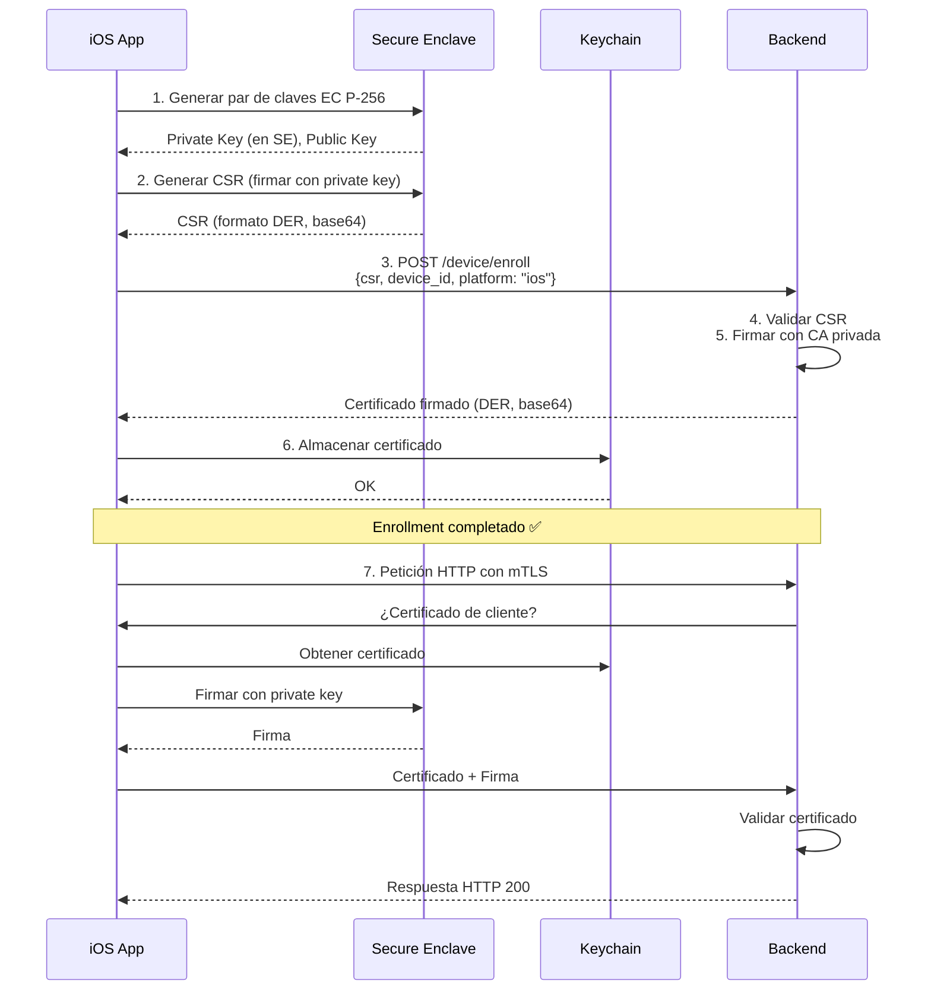

# Implementación de mTLS y Secure Enclave para iOS

## 📋 Resumen

Se ha implementado soporte completo para **mTLS (Mutual TLS)** con **Secure Enclave** (el HSM de iOS) en la aplicación Apuntador para iOS. Esta implementación es paralela a la de Android pero utiliza las APIs nativas de iOS.

## 🔐 Arquitectura

### **Secure Enclave**

El Secure Enclave es un coprocesador de seguridad aislado incluido en:
- iPhone 5s y posteriores
- iPad Air, iPad Pro y posteriores  
- Apple Watch Serie 1 y posteriores

**Características clave:**
- ✅ Almacena claves privadas de forma hardware-backed
- ✅ Las claves privadas **NUNCA** pueden ser exportadas
- ✅ Soporta operaciones criptográficas (firma, cifrado)
- ✅ Aislado del procesador principal (seguridad física)
- ✅ Compatible con biometría (Touch ID, Face ID)

### **Componentes implementados**

```
┌─────────────────────────────────────────────────────────┐
│              TypeScript/JavaScript Layer                │
├─────────────────────────────────────────────────────────┤
│  - iosSecureEnclaveService.ts                          │
│  - ios-mtls.ts (TypeScript interfaces)                │
└────────────────────┬────────────────────────────────────┘
                     │ Capacitor Bridge
┌────────────────────▼────────────────────────────────────┐
│              Swift Native Layer                         │
├─────────────────────────────────────────────────────────┤
│  Plugins:                                              │
│  - SecureEnclavePlugin.swift    (gestión de claves)   │
│  - AutoEnrollmentPlugin.swift   (enrollment)          │
│                                                        │
│  Core:                                                 │
│  - SecureEnclaveManager.swift   (operaciones HSM)     │
│  - CSRGenerator.swift           (generación CSR)      │
│  - MTLSHTTPClient.swift         (cliente HTTP)        │
└────────────────────┬────────────────────────────────────┘
                     │
         ┌───────────▼───────────┐
         │   Secure Enclave     │
         │   (Hardware HSM)     │
         │                      │
         │  • Private Key       │
         │  • Signing Ops       │
         │  • Never Exported    │
         └──────────────────────┘
```

## 📁 Archivos creados

### **Swift (iOS Native)**

1. **`ios/App/App/Plugins/SecureEnclavePlugin.swift`** (290 líneas)
   - Plugin principal de Capacitor
   - Métodos expuestos a JavaScript:
     - `isSecureEnclaveAvailable()` - Verifica disponibilidad del Secure Enclave
     - `generateKeyPair()` - Genera par de claves EC (P-256) en el Secure Enclave
     - `generateCSR(commonName, organization, country)` - Genera CSR firmado
     - `storeCertificate(certificate)` - Almacena certificado en Keychain
     - `getCertificate()` - Obtiene certificado almacenado
     - `hasCertificate()` - Verifica si existe certificado
     - `deleteAll()` - Elimina todas las credenciales

2. **`ios/App/App/Plugins/SecureEnclaveManager.swift`** (135 líneas)
   - Manager de operaciones del Secure Enclave
   - Genera claves EC P-256 en el Secure Enclave
   - Firma datos usando la clave privada
   - Verifica disponibilidad del Secure Enclave
   - Configuración crítica: `kSecAttrTokenIDSecureEnclave`

3. **`ios/App/App/Plugins/CSRGenerator.swift`** (380 líneas)
   - Genera Certificate Signing Request (CSR) en formato PKCS#10
   - Codificación ASN.1 DER completa
   - Subject Name: CN, O, C (CommonName, Organization, Country)
   - Algoritmo: ECDSA con SHA256
   - SubjectPublicKeyInfo con clave EC P-256
   - Firma del CSR usando Secure Enclave

4. **`ios/App/App/Plugins/MTLSHTTPClient.swift`** (230 líneas)
   - Cliente HTTP con soporte mTLS
   - Implementa `URLSessionDelegate` para autenticación de cliente
   - Crea `SecIdentity` desde certificado + clave privada
   - Maneja desafíos de autenticación TLS
   - Soporte para validación de certificados del servidor (certificate pinning)

5. **`ios/App/App/Plugins/AutoEnrollmentPlugin.swift`** (240 líneas)
   - Plugin de auto-enrollment
   - Métodos expuestos:
     - `checkEnrollmentStatus()` - Verifica estado del enrollment
     - `autoEnroll(backendUrl)` - Realiza enrollment automático
     - `reEnroll(backendUrl)` - Re-enrollment (renovación)
   - Proceso completo:
     1. Genera par de claves en Secure Enclave
     2. Genera CSR
     3. Envía CSR al backend (`/device/enroll`)
     4. Recibe certificado firmado
     5. Almacena certificado en Keychain

6. **`ios/App/App/Plugins/PluginRegistration.swift`**
   - Registra los plugins con Capacitor
   - Define los métodos expuestos

### **TypeScript (Frontend)**

1. **`src/plugins/ios-mtls.ts`** (120 líneas)
   - Interfaces TypeScript para los plugins nativos
   - `SecureEnclavePlugin` interface
   - `AutoEnrollmentPlugin` interface
   - Registro de plugins con Capacitor

2. **`src/services/iosSecureEnclaveService.ts`** (270 líneas)
   - Servicio de alto nivel para iOS
   - Singleton pattern (`getInstance()`)
   - Métodos principales:
     - `isSecureEnclaveAvailable()` - Verifica disponibilidad
     - `checkEnrollmentStatus()` - Estado del enrollment
     - `ensureEnrolled()` - Auto-enrollment idempotente y thread-safe
     - `forceReEnroll()` - Renovación forzada de certificado
     - `deleteAllCredentials()` - Limpieza (testing/debugging)
     - `getDeviceInfo()` - Información del dispositivo
   - Manejo inteligente de concurrencia (evita múltiples enrollments simultáneos)
   - Logging detallado de todo el proceso

## 🚀 Proceso de Auto-Enrollment

### **Flujo completo**



### **Código de ejemplo**

```typescript
import { iosSecureEnclaveService } from '@/services/iosSecureEnclaveService'

// 1. Verificar si el dispositivo tiene Secure Enclave
const hasSecureEnclave = await iosSecureEnclaveService.isSecureEnclaveAvailable()
console.log('Secure Enclave:', hasSecureEnclave)

// 2. Verificar estado del enrollment
const status = await iosSecureEnclaveService.checkEnrollmentStatus()
console.log('Enrolled:', status.enrolled)

// 3. Auto-enrollment automático (idempotente)
const result = await iosSecureEnclaveService.ensureEnrolled()
if (result.success) {
  console.log('✅ Device enrolled:', result.deviceId)
  console.log('Certificate size:', result.certificateSize, 'bytes')
} else {
  console.error('❌ Enrollment failed:', result.error)
}

// 4. Forzar re-enrollment (renovación)
const reEnrollResult = await iosSecureEnclaveService.forceReEnroll()
```

## 🔄 Comparación Android vs iOS

| Aspecto | Android | iOS |
|---------|---------|-----|
| **HSM** | Android Keystore (TEE/StrongBox) | Secure Enclave |
| **Algoritmo** | EC P-256 | EC P-256 |
| **Storage** | Android Keystore | Keychain + Secure Enclave |
| **Exportable** | No (hardware-backed) | No (hardware-isolated) |
| **API** | Java/Kotlin (`KeyStore`, `KeyPairGenerator`) | Swift (`Security.framework`, `SecKey`) |
| **CSR** | BouncyCastle library | Manual ASN.1 DER encoding |
| **mTLS** | OkHttp + X509TrustManager | URLSession + URLSessionDelegate |
| **Biometría** | BiometricPrompt | Touch ID / Face ID (via SecAccessControl) |
| **Device ID** | `Settings.Secure.ANDROID_ID` | `UIDevice.identifierForVendor` |

## 📱 Requisitos del dispositivo

### **iOS**

- **Dispositivos compatibles:**
  - iPhone 5s o posterior
  - iPad Air, iPad Pro o posterior
  - Cualquier iPad con chip A7 o posterior

- **iOS versión:** 12.0 o posterior (recomendado iOS 15+)

- **Secure Enclave:** Automáticamente disponible en dispositivos compatibles

## 🧪 Testing

### **Verificar Secure Enclave (desde la app)**

```typescript
import { SecureEnclave } from '@/plugins/ios-mtls'

const result = await SecureEnclave.isSecureEnclaveAvailable()
console.log('Secure Enclave available:', result.available)
console.log('Device:', result.deviceModel, result.osVersion)
```

### **Probar enrollment manual**

```typescript
import { iosSecureEnclaveService } from '@/services/iosSecureEnclaveService'

// Eliminar credenciales antiguas (testing)
await iosSecureEnclaveService.deleteAllCredentials()

// Realizar enrollment
const result = await iosSecureEnclaveService.ensureEnrolled()
console.log('Enrollment result:', result)
```

### **Logs en Xcode Console**

Todos los componentes Swift incluyen logging detallado:

```
🔐 [Auto-Enrollment] Starting enrollment process...
🔑 [Auto-Enrollment] Generating key pair in Secure Enclave...
📝 [Auto-Enrollment] Generating CSR...
   - Device ID: ios-ABC123-456DEF
   - CSR size: 384 bytes
📤 [Auto-Enrollment] Sending CSR to backend...
📥 [Auto-Enrollment] Received certificate from backend
✅ [Auto-Enrollment] Enrollment completed successfully!
   - Certificate stored in Keychain
   - Private key secured in Secure Enclave
```

## 🔧 Integración en la aplicación

### **Paso 1: Verificar en app startup**

```typescript
// src/app/main.ts o src/composables/useApp.ts

import { Capacitor } from '@capacitor/core'
import { iosSecureEnclaveService } from '@/services/iosSecureEnclaveService'
import { androidKeystoreService } from '@/services/androidKeystoreService'

async function initializeMTLS() {
  const platform = Capacitor.getPlatform()
  
  if (platform === 'ios') {
    console.log('📱 Initializing iOS mTLS with Secure Enclave...')
    const result = await iosSecureEnclaveService.ensureEnrolled()
    
    if (!result.success) {
      console.error('❌ iOS enrollment failed:', result.error)
      // Mostrar error al usuario
    } else {
      console.log('✅ iOS mTLS ready')
    }
  } else if (platform === 'android') {
    console.log('🤖 Initializing Android mTLS with Keystore...')
    const result = await androidKeystoreService.ensureEnrolled()
    
    if (!result.success) {
      console.error('❌ Android enrollment failed:', result.error)
    } else {
      console.log('✅ Android mTLS ready')
    }
  }
}

// Llamar en el startup de la app
await initializeMTLS()
```

### **Paso 2: Usar el cliente mTLS**

El cliente mTLS ya está configurado para usar automáticamente los certificados:

```typescript
// Las peticiones HTTP usarán automáticamente mTLS
import { CapacitorHttp } from '@capacitor/core'

const response = await CapacitorHttp.get({
  url: 'https://api.apuntador.io/user/profile'
})

// iOS/Android configurarán automáticamente el certificado
// El backend validará el certificado de cliente
```

## 🔒 Seguridad

### **Secure Enclave**

1. **Hardware-isolated:** El Secure Enclave es un coprocesador separado del CPU principal
2. **Claves no exportables:** Las claves privadas NUNCA salen del Secure Enclave
3. **Operaciones firmadas:** Solo se pueden realizar operaciones de firma, no extracción de claves
4. **Boot-time verification:** El Secure Enclave verifica la integridad del sistema en cada arranque

### **Keychain**

1. **Encrypted storage:** Los certificados se almacenan cifrados en el Keychain
2. **Access control:** Solo la app puede acceder a sus propias entradas del Keychain
3. **Backup:** Los certificados marcados como `kSecAttrAccessibleWhenUnlockedThisDeviceOnly` NO se respaldan en iCloud

### **CSR Generation**

1. **ASN.1 DER encoding:** Formato estándar X.509 para CSR
2. **ECDSA with SHA256:** Algoritmo de firma criptográficamente seguro
3. **Subject validation:** El backend valida el Common Name (device ID)

## 📊 Estado de implementación

### ✅ **Completado**

- [x] Secure Enclave Plugin (Swift)
- [x] Auto-Enrollment Plugin (Swift)
- [x] CSR Generator con ASN.1 DER encoding
- [x] mTLS HTTP Client con URLSession
- [x] TypeScript interfaces
- [x] iOS Secure Enclave Service
- [x] Logging detallado
- [x] Error handling completo
- [x] Thread-safe enrollment
- [x] Documentación completa

### ⏳ **Pendiente**

- [ ] Testing en iPad físico
- [ ] Validación con backend real
- [ ] Certificate pinning (validación del certificado del servidor)
- [ ] Soporte para biometría (Touch ID/Face ID) opcional
- [ ] Renovación automática de certificados próximos a expirar
- [ ] Métricas y telemetría de enrollment

### 🔮 **Futuras mejoras**

- [ ] Soporte para múltiples certificados (producción vs staging)
- [ ] Attestation del dispositivo (DeviceCheck)
- [ ] Rotación de claves periódica
- [ ] Dashboard de gestión de dispositivos enrolled

## 🐛 Debugging

### **Safari Web Inspector**

1. Conectar iPad al Mac vía USB
2. Abrir Safari > Develop > [iPad Name] > [App Name]
3. Ver console logs de JavaScript

### **Xcode Console**

1. Abrir el proyecto en Xcode
2. Build and Run en el iPad
3. Ver logs nativos de Swift:
   - `🔐 [Auto-Enrollment]` - Proceso de enrollment
   - `✅` - Operaciones exitosas
   - `❌` - Errores

### **Verificar certificado almacenado**

```swift
// En SecureEnclavePlugin.swift, añadir breakpoint en loadCertificate()
// o usar el método getCertificate() desde JavaScript

const result = await SecureEnclave.getCertificate()
if (result.success) {
  console.log('Certificate:', result.certificate)  // Base64 DER
  console.log('Size:', result.size, 'bytes')
} else {
  console.log('No certificate found')
}
```

## 🆘 Troubleshooting

### **Error: "Secure Enclave not available"**

- **Causa:** Dispositivo no tiene Secure Enclave (anterior a iPhone 5s)
- **Solución:** Usar un dispositivo compatible (iPhone 5s o posterior, iPad Air o posterior)

### **Error: "Failed to generate key pair"**

- **Causa:** Problema con permisos o configuración del Secure Enclave
- **Solución:** 
  1. Verificar que el dispositivo no está comprometido (jailbreak)
  2. Reiniciar el dispositivo
  3. Verificar configuración de código signing en Xcode

### **Error: "Backend error: Invalid CSR"**

- **Causa:** El CSR generado tiene formato incorrecto
- **Solución:**
  1. Verificar que el backend puede parsear CSR en formato DER
  2. Revisar logs del backend para detalles del error
  3. Comparar con CSR de Android (ambos deben ser DER)

### **Error: "Failed to create SecIdentity"**

- **Causa:** Certificado y clave privada no están emparejados correctamente
- **Solución:**
  1. Eliminar credenciales: `await iosSecureEnclaveService.deleteAllCredentials()`
  2. Hacer re-enrollment: `await iosSecureEnclaveService.forceReEnroll()`

## 📚 Referencias

- [Apple Security Framework](https://developer.apple.com/documentation/security)
- [Secure Enclave Overview](https://support.apple.com/guide/security/secure-enclave-sec59b0b31ff/web)
- [Certificate Signing Request (PKCS#10)](https://datatracker.ietf.org/doc/html/rfc2986)
- [ASN.1 DER Encoding](https://www.itu.int/rec/T-REC-X.690/)
- [URLSession with Client Certificates](https://developer.apple.com/documentation/foundation/urlsessiondelegate)
- [iOS Keychain Services](https://developer.apple.com/documentation/security/keychain_services)

---

**Fecha de creación:** 29 de octubre de 2025  
**Autor:** GitHub Copilot  
**Estado:** ✅ Implementación completa lista para testing
