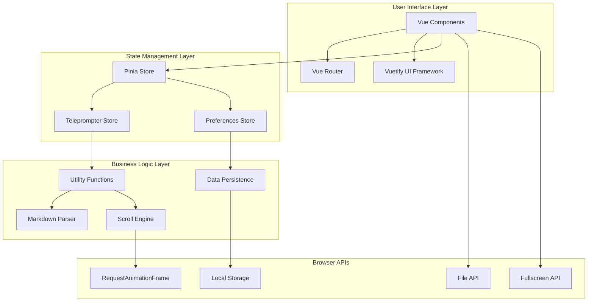
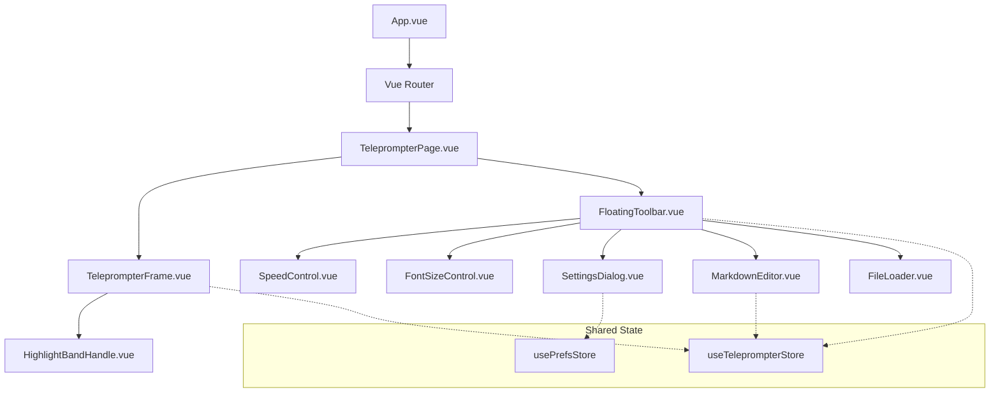
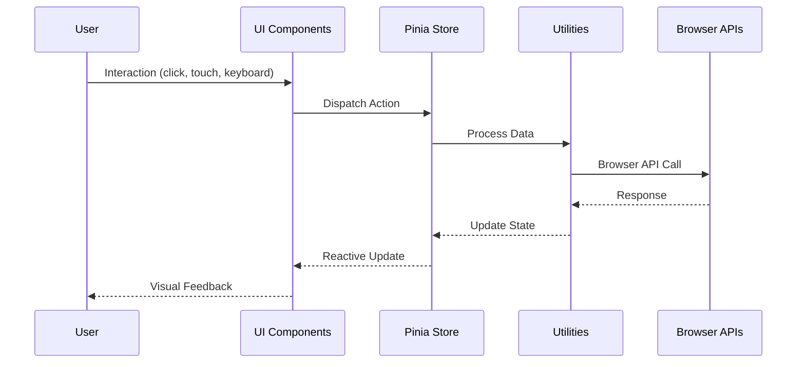

# Architecture Overview

Apuntador follows a modern Vue 3 architecture with clear separation of concerns and reactive state management.

## System Architecture

## Component Architecture

## Data Flow

## Tech Stack Details

### Frontend Framework

- **Vue 3.4+** - Composition API, `<script setup>`
- **TypeScript 5.0+** - Full type safety
- **Vuetify 3.4+** - Material Design components

### Build & Development

- **Vite 5.0+** - Fast development server and optimized builds
- **ESLint** - Code linting with Vue and TypeScript rules
- **Prettier** - Code formatting
- **Stylelint** - CSS/SCSS linting

### State Management

- **Pinia 2.1+** - Modern Vuex alternative
- **localforage** - Async storage with IndexedDB/WebSQL/localStorage fallback

### Testing

- **Vitest** - Fast unit testing framework
- **Vue Test Utils** - Vue component testing utilities
- **Playwright** - Cross-browser E2E testing
- **jsdom** - DOM environment for testing

### Utilities

- **markdown-it** - Markdown parsing with plugins
- **Zod** - Runtime type validation
- **TypeScript** - Compile-time type checking

## Performance Optimizations

### Rendering Performance

- **Virtual scrolling** for large documents
- **RAF-based** smooth animations
- **CSS transforms** for GPU acceleration
- **Debounced** resize handlers

### Memory Management

- **Reactive watchers** cleanup on component unmount
- **Event listener** removal in lifecycle hooks
- **Computed properties** for expensive calculations
- **LocalStorage** cleanup utilities

### Bundle Optimization

- **Tree shaking** for unused code elimination
- **Code splitting** for route-based chunks
- **Asset optimization** with Vite
- **Compression** for production builds

## Security Considerations

### Data Privacy

- **No external requests** - all processing local
- **No analytics** or tracking
- **User-controlled** data persistence
- **File validation** for imports

### Input Validation

- **Zod schemas** for runtime validation
- **TypeScript** for compile-time checks
- **File type** restrictions
- **Content sanitization** for HTML output

## Browser Compatibility

### Supported Features

- **ES2020** syntax and features
- **CSS Grid** and Flexbox
- **RequestAnimationFrame** for animations
- **File API** for imports
- **Fullscreen API** (where available)

### Graceful Degradation

- **Fallback** for unsupported Fullscreen API
- **Alternative** interaction methods on mobile
- **Progressive enhancement** for advanced features
