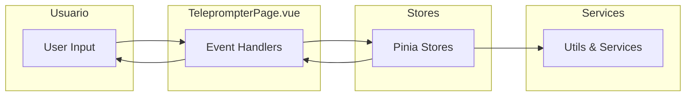
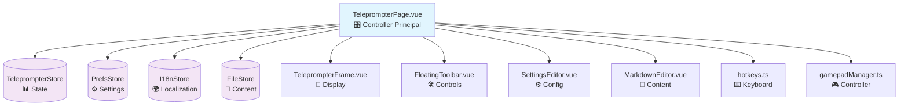
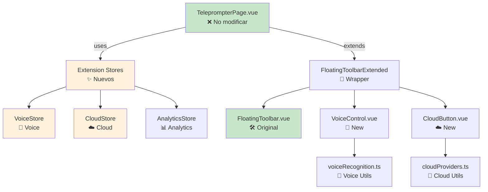
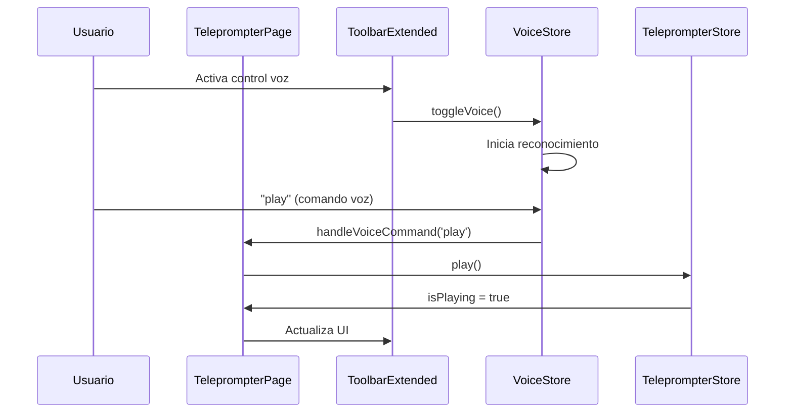
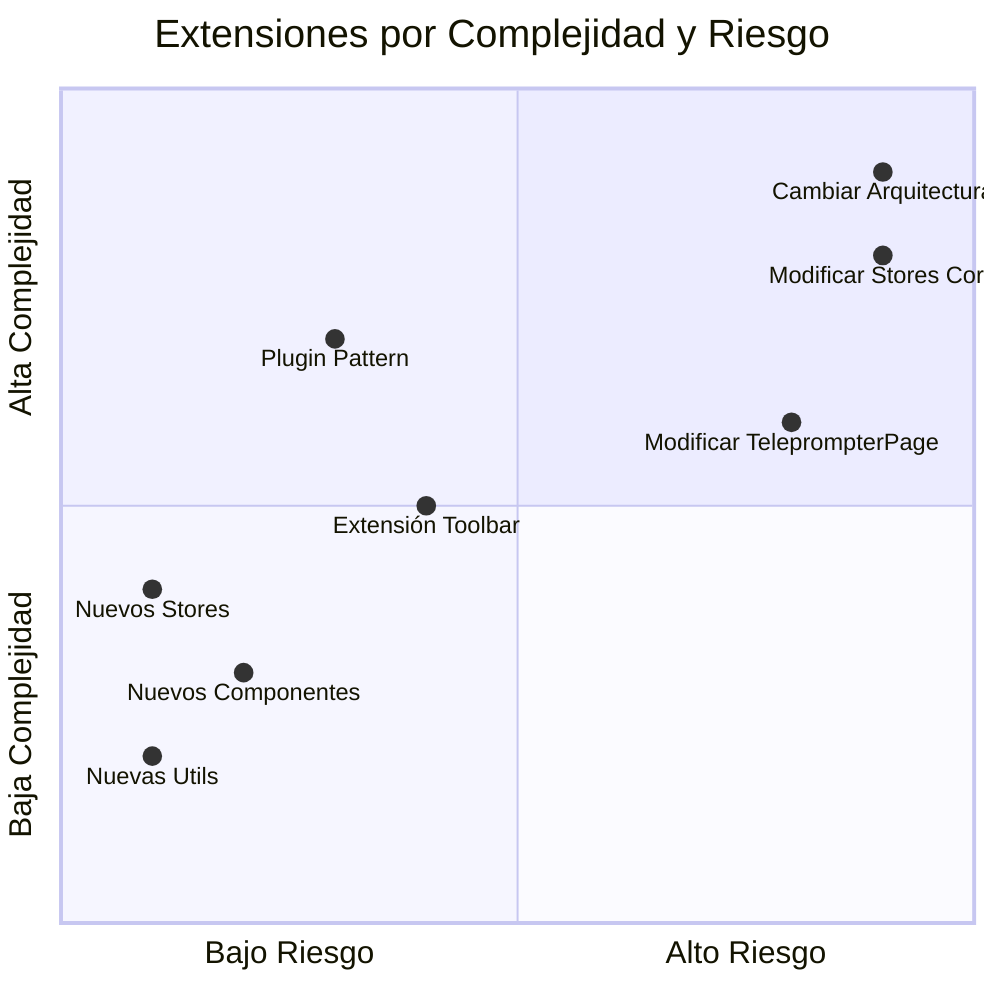
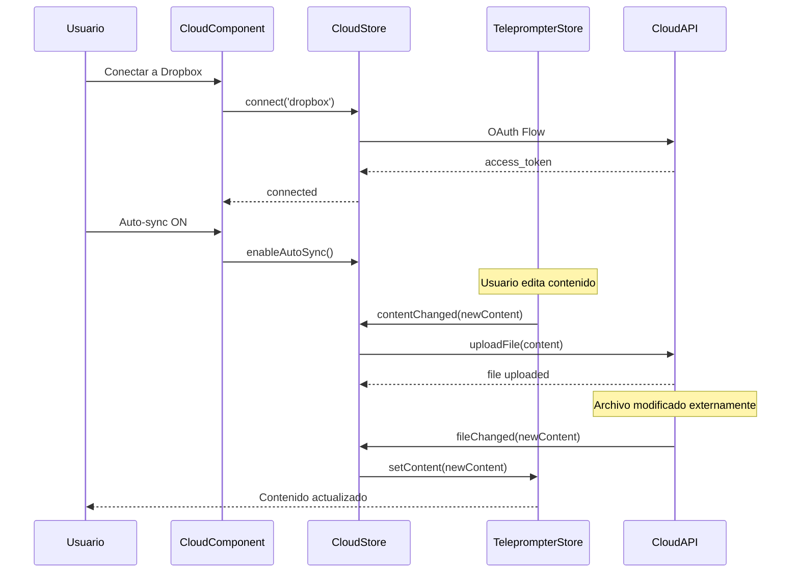

# 🧩 Guía de Extensibilidad - Apuntador

Este documento proporciona una guía completa para extender Apuntador de manera segura, basada en la implementación funcional de `TeleprompterPage.vue`, manteniendo la compatibilidad con las interfaces existentes y siguiendo las mejores prácticas arquitectónicas.

## 📋 Índice

- [🏗️ Análisis de Arquitectura](#️-análisis-de-arquitectura)
- [📊 Diagrama de Dependencias](#-diagrama-de-dependencias)
- [🎯 Puntos de Inserción](#-puntos-de-inserción-para-nuevos-componentes)
- [🛠️ Estrategias de Extensión](#️-estrategias-de-extensión-recomendadas)
- [🔧 Ejemplos Prácticos](#-ejemplos-prácticos)
- [📊 Matriz de Riesgo](#-matriz-de-riesgo-por-capa)
- [✅ Mejores Prácticas](#-mejores-prácticas)

---

## 🏗️ Análisis de Arquitectura

Apuntador utiliza una **arquitectura híbrida** que combina acceso directo a stores con adapters opcionales. La aplicación principal (`TeleprompterPage.vue`) es completamente funcional y estable, proporcionando una base sólida para extensiones.

### **Capas Arquitectónicas Reales**

1. **🖥️ Presentation Layer**: `TeleprompterPage.vue` + componentes modulares
2. **🔗 Adapter Layer**: `storeToComponent.ts` (opcional, para interfaces tipadas)
3. **🧠 Business Logic Layer**: Stores Pinia con estado centralizado
4. **⚙️ Service Layer**: Utilidades especializadas (scrolling, hotkeys, gamepad, etc.)
5. **📦 External Dependencies**: Vue 3, Vuetify, Capacitor, Tauri

### **Principios de Diseño Validados**

- **Acceso Directo a Stores**: `TeleprompterPage` accede directamente a stores para máxima flexibilidad
- **Componentes Modulares**: Cada componente tiene responsabilidades claras y bien definidas
- **Event-Driven Communication**: Comunicación mediante events entre componentes
- **Extensibilidad Incremental**: Nuevas funcionalidades sin modificar código existente

---

## 📊 Diagrama de Dependencias

### **Vista General - Arquitectura Real**

```mermaid
graph TB
    %% ===== MAIN APPLICATION =====
    subgraph "🖥️ Application Layer"
        TPage[TeleprompterPage.vue]
        Router[router.ts]
    end

    %% ===== COMPONENTS =====
    subgraph "🧩 Component Layer"
        TFrame[TeleprompterFrameV2.vue]
        FToolbar[FloatingToolbarModular.vue]
        Settings[SettingsDialog.vue]
        Editor[MarkdownEditor.vue]
        FileLoad[FileLoader.vue]
        HBHandle[HighlightBandHandle.vue]
        SpeedCtrl[SpeedControl.vue]
        FontCtrl[FontSizeControl.vue]
        GamepadCtrl[GamepadControl.vue]
        HotkeyCtrl[HotkeyControl.vue]
        TextAlign[TextAlignmentControls.vue]
    end

    %% ===== ADAPTERS (OPTIONAL) =====
    subgraph "🔗 Adapter Layer (Optional)"
        StoreAdapter[storeToComponent.ts]
        Interfaces[component-interfaces.d.ts]
    end

    %% ===== BUSINESS LOGIC =====
    subgraph "🧠 Business Logic Layer"
        TStore[useTeleprompterStore.ts]
        PrefsStore[usePrefsStore.ts]
        I18nStore[useI18nStore.ts]
        FileStore[useFileStore.ts]
    end

    %% ===== SERVICES =====
    subgraph "⚙️ Service Layer"
        subgraph "🛠️ Core Services"
            Scrolling[scrolling.ts]
            Markdown[markdown.ts]
            Hotkeys[hotkeys.ts]
            GamepadMgr[gamepadManager.ts]
            Persistence[persistence.ts]
            Constants[constants.ts]
        end
        
        subgraph "🌐 Platform Services"
            I18nUtils[i18n.ts]
            Capacitor[capacitor.ts]
            Tauri[tauri.ts]
            FileSystem[fileSystem.ts]
            DOM[dom.ts]
            Fullscreen[fullscreen.ts]
        end
    end

    %% ===== EXTERNAL =====
    subgraph "📦 External Dependencies"
        Vue[Vue 3]
        Vuetify[Vuetify 3]
        Pinia[Pinia]
        VueI18n[Vue I18n]
        MarkdownIt[markdown-it]
        Localforage[localforage]
    end

    %% ===== MAIN CONNECTIONS =====
    Router --> TPage
    TPage --> TFrame
    TPage --> FToolbar
    TPage --> Settings
    TPage --> Editor
    TPage --> FileLoad

    %% ===== COMPONENT CONNECTIONS =====
    TFrame --> HBHandle
    FToolbar --> SpeedCtrl
    FToolbar --> FontCtrl
    Settings --> GamepadCtrl
    Settings --> HotkeyCtrl
    Settings --> TextAlign

    %% ===== DIRECT STORE ACCESS =====
    TPage --> TStore
    TPage --> PrefsStore
    TPage --> I18nStore
    TPage --> FileStore
    
    Settings --> PrefsStore
    Settings --> I18nStore
    FileLoad --> FileStore
    Editor --> TStore

    %% ===== OPTIONAL ADAPTER =====
    TPage -.-> StoreAdapter
    StoreAdapter -.-> Interfaces
    StoreAdapter --> TStore
    StoreAdapter --> PrefsStore

    %% ===== STORE DEPENDENCIES =====
    TStore --> Scrolling
    TStore --> Markdown
    TStore --> Persistence
    TStore --> Constants
    
    PrefsStore --> Persistence
    PrefsStore --> Constants
    PrefsStore --> Hotkeys
    
    I18nStore --> I18nUtils
    FileStore --> FileSystem

    %% ===== SERVICE DEPENDENCIES =====
    Scrolling --> Constants
    Hotkeys --> Constants
    GamepadMgr --> Constants
    
    Persistence --> Localforage
    Markdown --> MarkdownIt
    I18nUtils --> VueI18n
    
    %% ===== PLATFORM INTEGRATION =====
    TPage --> Hotkeys
    TPage --> GamepadMgr
    TPage --> Capacitor
    
    FileSystem --> Capacitor
    FileSystem --> Tauri
    Fullscreen --> Tauri

    %% ===== EXTERNAL FRAMEWORK =====
    TPage --> Vue
    TPage --> Vuetify
    TPage --> VueI18n
    
    TStore --> Pinia
    PrefsStore --> Pinia
    I18nStore --> Pinia
    FileStore --> Pinia

    %% ===== STYLING =====
    classDef app fill:#e3f2fd,stroke:#1976d2,stroke-width:2px
    classDef component fill:#f3e5f5,stroke:#7b1fa2
    classDef adapter fill:#fff3e0,stroke:#f57c00
    classDef store fill:#e8f5e8,stroke:#388e3c
    classDef service fill:#fce4ec,stroke:#c2185b
    classDef external fill:#f5f5f5,stroke:#616161
    
    class TPage,Router app
    class TFrame,FToolbar,Settings,Editor,FileLoad,HBHandle,SpeedCtrl,FontCtrl component
    class StoreAdapter,Interfaces adapter
    class TStore,PrefsStore,I18nStore,FileStore store
    class Scrolling,Markdown,Hotkeys,GamepadMgr,Persistence,Constants,I18nUtils,Capacitor,Tauri,FileSystem,DOM,Fullscreen service
    class Vue,Vuetify,Pinia,VueI18n,MarkdownIt,Localforage external
```



### **Flujo de Datos Simplificado**



---

## 🎯 Puntos de Inserción para Nuevos Componentes

Basándonos en la arquitectura real de `TeleprompterPage.vue`, existen varios puntos seguros y efectivos para insertar nuevas funcionalidades.

### **1. 🟢 Puntos Muy Seguros (Sin Riesgo)**

#### **A. Nuevos Componentes Independientes**

Agrega componentes que se integren fácilmente con la estructura existente:

```typescript
// ✅ Componentes que puedes agregar sin modificar TeleprompterPage
src/components/
├── VoiceControl.vue          // Control por voz con botón en toolbar
├── CloudSyncStatus.vue       // Indicador de estado de sincronización  
├── SessionTimer.vue          // Temporizador de sesión de lectura
├── ReadingAnalytics.vue      // Estadísticas de lectura en tiempo real
├── RemoteControlPanel.vue    // Panel para control remoto
├── AIAssistant.vue           // Asistente IA para optimización
└── ThemeSwitch.vue           // Cambio rápido de temas
```

**Integración en TeleprompterPage**:
```vue
<!-- En TeleprompterPage.vue, agregar en la toolbar o como overlay -->
<FloatingToolbarModular
  :scroll-state="..."
  :speed-config="..."
  @play="onPlay"
  @pause="onPause"
  <!-- ... eventos existentes ... -->
>
  <!-- ✨ Slot para nuevos componentes -->
  <template #extra-controls>
    <VoiceControl @voice-command="handleVoiceCommand" />
    <CloudSyncStatus @sync-request="handleSyncRequest" />
  </template>
</FloatingToolbarModular>
```

#### **B. Nuevos Stores Independientes**

```typescript
// ✅ Stores completamente independientes
src/stores/
├── useVoiceStore.ts          // Estado del control por voz
├── useCloudStore.ts          // Estado de sincronización cloud
├── useAnalyticsStore.ts      // Analytics local de lectura  
├── useSessionStore.ts        // Gestión de sesiones
├── useRemoteStore.ts         // Control remoto
└── useThemeStore.ts          // Gestión avanzada de temas
```

**Integración sin conflictos**:
```typescript
// En TeleprompterPage.vue - agregar al script setup
const voiceStore = useVoiceStore()      // ✅ Sin conflictos
const cloudStore = useCloudStore()      // ✅ Independiente  
const analyticsStore = useAnalyticsStore() // ✅ No interfiere

// Los stores se auto-registran con Pinia
```

#### **C. Nuevas Utilidades de Servicio**

```typescript
// ✅ Servicios independientes sin dependencias cruzadas
src/utils/
├── voiceRecognition.ts       // API de reconocimiento de voz
├── cloudProviders.ts         // Integración con Dropbox, Drive, etc.
├── readingAnalytics.ts       // Cálculos de velocidad, pausas, etc.
├── sessionManagement.ts      // Gestión de sesiones de lectura
├── remoteControl.ts          // Servidor WebSocket para control remoto
├── aiIntegration.ts          // Integración con APIs de IA
└── exportFormats.ts          // Export a PDF, DOCX, etc.
```

### **2. 🟡 Puntos Moderados (Requieren Extensión Cuidadosa)**

#### **A. Extensión de FloatingToolbarModular**

La toolbar actual acepta props y eventos específicos. Puedes extenderla:

```vue
<!-- src/components/FloatingToolbarExtended.vue -->
<template>
  <div class="extended-toolbar">
    <!-- Toolbar original -->
    <FloatingToolbarModular
      v-bind="$props"
      v-on="$listeners"
    />
    
    <!-- ✨ Extensiones nuevas -->
    <div v-if="showExtensions" class="toolbar-extensions">
      <VoiceControl v-if="voiceEnabled" />
      <CloudSyncButton v-if="cloudEnabled" />
      <SessionTimer v-if="sessionEnabled" />
    </div>
  </div>
</template>
```

**Uso en TeleprompterPage**:
```vue
<!-- Reemplazar FloatingToolbarModular por versión extendida -->
<FloatingToolbarExtended
  :scroll-state="..."
  :speed-config="..."
  :voice-enabled="voiceStore.isEnabled"
  :cloud-enabled="cloudStore.isConnected"
  @play="onPlay"
  @voice-command="handleVoiceCommand"
  @cloud-sync="handleCloudSync"
/>
```

#### **B. Extensión de Event Handlers en TeleprompterPage**

```typescript
// En TeleprompterPage.vue - agregar nuevos handlers
function handleVoiceCommand(command: string) {
  switch (command) {
    case 'play': onPlay(); break
    case 'pause': onPause(); break
    case 'faster': onSpeedChange(1); break
    case 'slower': onSpeedChange(-1); break
  }
}

function handleCloudSync() {
  const content = teleprompterStore.contentRaw
  cloudStore.syncContent(content)
}

function handleAnalyticsEvent(event: AnalyticsEvent) {
  analyticsStore.recordEvent(event)
}
```

#### **C. Extensión Opcional de Interfaces**

Si quieres usar el patrón de interfaces (opcional):

```typescript
// src/types/component-interfaces.d.ts - extensiones opcionales

// ✨ NUEVAS interfaces para extensiones
export interface VoiceControlConfig {
  enabled: boolean
  listening: boolean
  language: string
  commands: VoiceCommand[]
}

export interface CloudSyncConfig {
  provider: 'dropbox' | 'googledrive' | 'onedrive'
  status: 'connected' | 'disconnected' | 'syncing'
  lastSync?: Date
}

// ✨ EXTENDER interfaces existentes (opcional)
export interface FloatingToolbarProps {
  // Existentes (NO TOCAR)
  scrollState: ScrollState
  speedConfig: SpeedConfig
  displayPrefs: DisplayPreferences
  isVisible: boolean
  isMinimal: boolean
  
  // ✨ NUEVAS (opcionales para compatibilidad)
  voiceControl?: VoiceControlConfig
  cloudSync?: CloudSyncConfig
  analytics?: AnalyticsConfig
}
```

### **3. 🔴 Puntos Críticos (Máximo Cuidado)**

#### **A. Modificaciones a TeleprompterPage.vue**

```vue
<!-- ⚠️ CUIDADO: Solo AGREGAR, nunca modificar lógica existente -->
<script setup lang="ts">
// ===== EXISTENTES (NO TOCAR) =====
const teleprompterStore = useTeleprompterStore()
const prefsStore = usePrefsStore()
const i18nStore = useI18nStore()
const fileStore = useFileStore()

// ===== ✨ NUEVOS STORES (Agregar al final) =====
const voiceStore = useVoiceStore()
const cloudStore = useCloudStore()
const analyticsStore = useAnalyticsStore()

// ===== NUEVOS EVENT HANDLERS (no interferir con existentes) =====
function onVoiceCommand(command: string) {
  // Nueva funcionalidad
}

function onCloudSyncRequest() {
  // Nueva funcionalidad  
}

// ===== INTEGRATION WATCHES (no modificar existentes) =====
watch(
  () => teleprompterStore.isPlaying,
  (isPlaying) => {
    // Integrarse con analytics sin modificar lógica existente
    if (isPlaying) {
      analyticsStore.startSession()
    } else {
      analyticsStore.pauseSession()
    }
  }
)
</script>
```

#### **B. Extensión de Stores Centrales (Solo Agregar)**

```typescript
// ⚠️ useTeleprompterStore.ts - Solo agregar al final, nunca modificar
export const useTeleprompterStore = defineStore('teleprompter', () => {
  // ===== EXISTENTES (❌ NO TOCAR) =====
  const contentRaw = ref('')
  const isPlaying = ref(false)
  // ... otros estados existentes

  function play() { /* implementación existente */ }
  function pause() { /* implementación existente */ }
  // ... otras funciones existentes

  // ===== ✨ NUEVOS ESTADOS (Agregar al final) =====
  const voiceControlEnabled = ref(false)
  const cloudSyncEnabled = ref(false)
  const analyticsEnabled = ref(false)

  // ===== ✨ NUEVAS FUNCIONES (Agregar al final) =====
  function enableVoiceControl() {
    voiceControlEnabled.value = true
  }

  function enableCloudSync() {
    cloudSyncEnabled.value = true
  }

  return {
    // ===== EXISTENTES (mantener orden) =====
    contentRaw,
    isPlaying,
    play,
    pause,
    // ... otros existentes

    // ===== ✨ NUEVOS (al final) =====
    voiceControlEnabled,
    cloudSyncEnabled,
    analyticsEnabled,
    enableVoiceControl,
    enableCloudSync,
  }
})
```

### **4. ✅ Patrón Recomendado: Plugin de Extensión**

La forma más segura de agregar funcionalidades complejas:

```typescript
// src/plugins/voiceControlExtension.ts
export function useVoiceControlExtension() {
  const teleprompterStore = useTeleprompterStore()
  const voiceStore = useVoiceStore()
  
  // Integración sin modificar stores existentes
  const integration = {
    setupVoiceCommands() {
      voiceStore.addCommand('play', () => teleprompterStore.play())
      voiceStore.addCommand('pause', () => teleprompterStore.pause())
      voiceStore.addCommand('faster', () => {
        const prefs = usePrefsStore()
        prefs.speedPxPerSec += 10
      })
    },
    
    connectToToolbar() {
      // Retorna props y handlers para la toolbar
      return {
        voiceProps: computed(() => ({
          enabled: voiceStore.isEnabled,
          listening: voiceStore.isListening,
        })),
        voiceHandlers: {
          onToggleVoice: () => voiceStore.toggle(),
          onVoiceCommand: (cmd: string) => voiceStore.executeCommand(cmd),
        }
      }
    }
  }
  
  return integration
}
```

**Uso en TeleprompterPage**:
```vue
<script setup lang="ts">
// Stores existentes
const teleprompterStore = useTeleprompterStore()
// ...

// ✨ Plugin de extensión
const voiceExtension = useVoiceControlExtension()

onMounted(async () => {
  // Inicialización existente
  await teleprompterStore.initialize()
  // ...
  
  // ✨ Inicializar extensión
  voiceExtension.setupVoiceCommands()
})

// ✨ Integrar con toolbar
const { voiceProps, voiceHandlers } = voiceExtension.connectToToolbar()
</script>
```

---

## 📊 Diagramas de Arquitectura Simplificados

> **💡 Tip para Mejor Visualización**: Si los diagramas mermaid no se ven bien en VS Code, instala la extensión "Markdown Preview Mermaid Support" o "Mermaid Markdown Syntax Highlighting".

### **Arquitectura Actual (TeleprompterPage.vue)**



### **Patrón de Extensión Recomendado**



### **Flujo de Datos con Extensiones**



### **Matriz de Complejidad vs Riesgo**



---

---

## 🛠️ Estrategias de Extensión Recomendadas

### **1. 🔌 Plugin Pattern (Más Recomendado)**

El patrón de plugins permite agregar funcionalidades de manera completamente modular:

```typescript
// src/plugins/voiceControlPlugin.ts
import type { App } from 'vue'
import VoiceControl from '@/components/VoiceControl.vue'
import { useVoiceStore } from '@/stores/useVoiceStore'

export interface VoiceControlPluginOptions {
  defaultLanguage?: string
  sensitivity?: number
  commands?: VoiceCommand[]
}

export const VoiceControlPlugin = {
  install(app: App, options: VoiceControlPluginOptions = {}) {
    // 1. Registrar componentes
    app.component('VoiceControl', VoiceControl)
    
    // 2. Registrar stores (se auto-registran cuando se usan)
    // El store se registra automáticamente con Pinia
    
    // 3. Registrar composables globales
    app.config.globalProperties.$voice = useVoiceControl()
    
    // 4. Configurar opciones por defecto
    const voiceStore = useVoiceStore()
    if (options.defaultLanguage) {
      voiceStore.setLanguage(options.defaultLanguage)
    }
    if (options.sensitivity) {
      voiceStore.setSensitivity(options.sensitivity)
    }
    
    // 5. Integración con teleprompter existente
    const teleprompterStore = useTeleprompterStore()
    voiceStore.onCommand('play', () => teleprompterStore.play())
    voiceStore.onCommand('pause', () => teleprompterStore.pause())
    voiceStore.onCommand('faster', () => {
      const prefs = usePrefsStore()
      prefs.speedPxPerSec = Math.min(prefs.speedPxPerSec + 10, prefs.speedMax)
    })
  }
}

// Uso en main.ts
import { VoiceControlPlugin } from '@/plugins/voiceControlPlugin'

app.use(VoiceControlPlugin, {
  defaultLanguage: 'es-ES',
  sensitivity: 0.7
})
```

### **2. 🎪 Composition API Pattern**

Usar composables para encapsular lógica compleja:

```typescript
// src/composables/useCloudIntegration.ts
export function useCloudIntegration() {
  const cloudStore = useCloudStore()
  const teleprompterStore = useTeleprompterStore()
  const fileStore = useFileStore()
  
  // Estado reactivo derivado
  const isConnected = computed(() => cloudStore.status === 'connected')
  const isSyncing = computed(() => cloudStore.status === 'syncing')
  
  // Operaciones de alto nivel
  const syncToCloud = async () => {
    if (!isConnected.value) {
      throw new Error('Not connected to cloud provider')
    }
    
    const content = teleprompterStore.contentRaw
    const fileName = fileStore.fileName
    
    cloudStore.setStatus('syncing')
    try {
      await cloudStore.uploadFile(fileName, content)
      cloudStore.setLastSync(new Date())
    } catch (error) {
      cloudStore.setStatus('error')
      throw error
    } finally {
      cloudStore.setStatus('connected')
    }
  }
  
  const loadFromCloud = async (fileId: string) => {
    const content = await cloudStore.downloadFile(fileId)
    await teleprompterStore.setContent(content)
    fileStore.markAsSaved() // No hay cambios pendientes
  }
  
  // Auto-sync cuando hay cambios
  const enableAutoSync = () => {
    watch(
      () => teleprompterStore.contentRaw,
      debounce(async (newContent) => {
        if (cloudStore.autoSyncEnabled && isConnected.value) {
          await syncToCloud()
        }
      }, 2000)
    )
  }
  
  return {
    // Estado
    isConnected,
    isSyncing,
    
    // Acciones
    syncToCloud,
    loadFromCloud,
    enableAutoSync,
    
    // Configuración
    connect: cloudStore.connect,
    disconnect: cloudStore.disconnect,
  }
}

// Uso en componente
export default defineComponent({
  setup() {
    const cloud = useCloudIntegration()
    
    onMounted(() => {
      cloud.enableAutoSync()
    })
    
    return { cloud }
  }
})
```

### **3. 🔗 Adapter Extension Pattern**

Extender adaptadores existentes sin modificarlos:

```typescript
// src/adapters/voiceControlAdapter.ts
export function useVoiceControlProps() {
  const voiceStore = useVoiceStore()
  const teleprompterStore = useTeleprompterStore()
  const prefsStore = usePrefsStore()
  
  return computed(() => ({
    voiceControl: {
      enabled: voiceStore.isEnabled,
      listening: voiceStore.isListening,
      language: voiceStore.currentLanguage,
      commands: voiceStore.availableCommands,
      sensitivity: voiceStore.sensitivity,
    },
    
    // Integración con estado existente
    isPlaying: teleprompterStore.isPlaying,
    canUseVoice: !teleprompterStore.isPlaying || prefsStore.voiceControlEnabled,
  }))
}

// src/adapters/enhancedStoreToComponent.ts
export function useEnhancedTeleprompterProps() {
  // Combinar props existentes con nuevas extensiones
  const baseProps = useTeleprompterFrameProps()
  const voiceProps = useVoiceControlProps()
  const cloudProps = useCloudSyncProps()
  
  return computed(() => ({
    ...baseProps.value,
    voiceControl: voiceProps.value.voiceControl,
    cloudSync: cloudProps.value.cloudSync,
  }))
}
```

### **4. 🏭 Factory Pattern para Componentes**

Crear componentes configurables dinámicamente:

```typescript
// src/factories/toolbarFactory.ts
export interface ToolbarConfiguration {
  layout: 'minimal' | 'compact' | 'full' | 'custom'
  features: {
    voice?: boolean
    cloud?: boolean
    collaboration?: boolean
    ai?: boolean
  }
  customButtons?: ToolbarButton[]
}

export function createToolbarComponent(config: ToolbarConfiguration) {
  return defineComponent({
    name: 'DynamicFloatingToolbar',
    props: ['scrollState', 'speedConfig', 'displayPrefs'],
    setup(props, { emit }) {
      const buttons = computed(() => {
        const baseButtons = getBaseButtons(config.layout)
        const featureButtons = getFeatureButtons(config.features)
        const customButtons = config.customButtons || []
        
        return [...baseButtons, ...featureButtons, ...customButtons]
      })
      
      return { buttons }
    },
    template: `
      <div class="dynamic-toolbar" :class="layoutClass">
        <ToolbarButton
          v-for="button in buttons"
          :key="button.id"
          v-bind="button"
          @click="$emit(button.event, button.payload)"
        />
      </div>
    `
  })
}

// Uso
const VoiceEnabledToolbar = createToolbarComponent({
  layout: 'compact',
  features: {
    voice: true,
    cloud: false,
  }
})
```

---

## 🔧 Ejemplos Prácticos

### **Ejemplo 1: Añadir Control por Voz**

#### **Paso 1: Crear Store de Voz (🟢 Seguro)**

```typescript
// src/stores/useVoiceStore.ts
import { defineStore } from 'pinia'
import { ref, computed } from 'vue'

export interface VoiceCommand {
  phrase: string
  action: string
  description: string
}

export const useVoiceStore = defineStore('voice', () => {
  // Estado
  const isEnabled = ref(false)
  const isListening = ref(false)
  const currentLanguage = ref('es-ES')
  const sensitivity = ref(0.7)
  const lastCommand = ref('')
  const lastConfidence = ref(0)
  
  // Comandos disponibles
  const commands = ref<VoiceCommand[]>([
    { phrase: 'reproducir', action: 'play', description: 'Iniciar reproducción' },
    { phrase: 'pausar', action: 'pause', description: 'Pausar reproducción' },
    { phrase: 'parar', action: 'pause', description: 'Pausar reproducción' },
    { phrase: 'más rápido', action: 'speed-up', description: 'Aumentar velocidad' },
    { phrase: 'más lento', action: 'speed-down', description: 'Reducir velocidad' },
    { phrase: 'al inicio', action: 'go-home', description: 'Ir al inicio' },
    { phrase: 'al final', action: 'go-end', description: 'Ir al final' },
  ])
  
  // Getters
  const isAvailable = computed(() => {
    return 'webkitSpeechRecognition' in window || 'SpeechRecognition' in window
  })
  
  const canStart = computed(() => {
    return isAvailable.value && isEnabled.value && !isListening.value
  })
  
  // Actions
  function enable() {
    isEnabled.value = true
  }
  
  function disable() {
    isEnabled.value = false
    if (isListening.value) {
      stopListening()
    }
  }
  
  function startListening() {
    if (!canStart.value) return false
    
    isListening.value = true
    // Implementación de SpeechRecognition
    return true
  }
  
  function stopListening() {
    isListening.value = false
  }
  
  function setLanguage(lang: string) {
    currentLanguage.value = lang
  }
  
  function setSensitivity(value: number) {
    sensitivity.value = Math.max(0, Math.min(1, value))
  }
  
  function addCommand(command: VoiceCommand) {
    commands.value.push(command)
  }
  
  function removeCommand(phrase: string) {
    const index = commands.value.findIndex(cmd => cmd.phrase === phrase)
    if (index > -1) {
      commands.value.splice(index, 1)
    }
  }
  
  return {
    // Estado
    isEnabled,
    isListening,
    currentLanguage,
    sensitivity,
    lastCommand,
    lastConfidence,
    commands,
    
    // Getters
    isAvailable,
    canStart,
    
    // Actions
    enable,
    disable,
    startListening,
    stopListening,
    setLanguage,
    setSensitivity,
    addCommand,
    removeCommand,
  }
})
```

#### **Paso 2: Crear Componente de Control de Voz (🟢 Seguro)**

```vue
<!-- src/components/VoiceControl.vue -->
<template>
  <div class="voice-control">
    <!-- Indicador de estado -->
    <v-chip
      :color="statusColor"
      :variant="isListening ? 'flat' : 'outlined'"
      size="small"
      class="voice-status"
    >
      <v-icon :icon="statusIcon" start />
      {{ statusText }}
    </v-chip>
    
    <!-- Botón de activación -->
    <v-btn
      v-if="isAvailable"
      :disabled="!canToggle"
      :color="isEnabled ? 'primary' : 'grey'"
      variant="text"
      icon
      @click="toggleVoice"
    >
      <v-icon :icon="isEnabled ? 'mdi-microphone' : 'mdi-microphone-off'" />
    </v-btn>
    
    <!-- Configuración avanzada -->
    <v-menu v-if="showSettings">
      <template #activator="{ props }">
        <v-btn icon variant="text" v-bind="props">
          <v-icon icon="mdi-cog" />
        </v-btn>
      </template>
      
      <v-card min-width="300">
        <v-card-text>
          <v-select
            v-model="selectedLanguage"
            :items="availableLanguages"
            label="Idioma"
            density="compact"
          />
          
          <v-slider
            v-model="sensitivityValue"
            label="Sensibilidad"
            :min="0"
            :max="1"
            :step="0.1"
            thumb-label
          />
          
          <v-list density="compact">
            <v-list-subheader>Comandos disponibles</v-list-subheader>
            <v-list-item
              v-for="command in commands"
              :key="command.phrase"
              :title="command.phrase"
              :subtitle="command.description"
            />
          </v-list>
        </v-card-text>
      </v-card>
    </v-menu>
  </div>
</template>

<script setup lang="ts">
import { computed, watch } from 'vue'
import { useVoiceStore } from '@/stores/useVoiceStore'
import { useTeleprompterStore } from '@/stores/useTeleprompterStore'
import { usePrefsStore } from '@/stores/usePrefsStore'

// Props
interface Props {
  showSettings?: boolean
}
const props = withDefaults(defineProps<Props>(), {
  showSettings: false
})

// Stores
const voiceStore = useVoiceStore()
const teleprompterStore = useTeleprompterStore()
const prefsStore = usePrefsStore()

// Estado reactivo
const isAvailable = computed(() => voiceStore.isAvailable)
const isEnabled = computed(() => voiceStore.isEnabled)
const isListening = computed(() => voiceStore.isListening)
const commands = computed(() => voiceStore.commands)

const canToggle = computed(() => {
  return isAvailable.value
})

// Estado visual
const statusColor = computed(() => {
  if (!isAvailable.value) return 'grey'
  if (!isEnabled.value) return 'grey'
  if (isListening.value) return 'success'
  return 'primary'
})

const statusIcon = computed(() => {
  if (!isAvailable.value) return 'mdi-microphone-off'
  if (!isEnabled.value) return 'mdi-microphone-off'
  if (isListening.value) return 'mdi-microphone'
  return 'mdi-microphone-outline'
})

const statusText = computed(() => {
  if (!isAvailable.value) return 'No disponible'
  if (!isEnabled.value) return 'Deshabilitado'
  if (isListening.value) return 'Escuchando...'
  return 'Listo'
})

// Configuración
const selectedLanguage = computed({
  get: () => voiceStore.currentLanguage,
  set: (value: string) => voiceStore.setLanguage(value)
})

const sensitivityValue = computed({
  get: () => voiceStore.sensitivity,
  set: (value: number) => voiceStore.setSensitivity(value)
})

const availableLanguages = [
  { title: 'Español (España)', value: 'es-ES' },
  { title: 'Español (México)', value: 'es-MX' },
  { title: 'English (US)', value: 'en-US' },
  { title: 'English (UK)', value: 'en-GB' },
  { title: 'Français', value: 'fr-FR' },
  { title: 'Deutsch', value: 'de-DE' },
  { title: 'Italiano', value: 'it-IT' },
  { title: 'Português (BR)', value: 'pt-BR' },
  { title: 'Català', value: 'ca-ES' },
]

// Actions
function toggleVoice() {
  if (isEnabled.value) {
    voiceStore.disable()
  } else {
    voiceStore.enable()
  }
}

// Integración con teleprompter (esto podría estar en un composable)
function setupVoiceIntegration() {
  // Escuchar comandos de voz y ejecutar acciones del teleprompter
  watch(() => voiceStore.lastCommand, (command) => {
    switch (command) {
      case 'play':
        teleprompterStore.play()
        break
      case 'pause':
        teleprompterStore.pause()
        break
      case 'speed-up':
        prefsStore.speedPxPerSec = Math.min(
          prefsStore.speedPxPerSec + 10, 
          prefsStore.speedMax
        )
        break
      case 'speed-down':
        prefsStore.speedPxPerSec = Math.max(
          prefsStore.speedPxPerSec - 10, 
          prefsStore.speedMin
        )
        break
      case 'go-home':
        teleprompterStore.toHome()
        break
      case 'go-end':
        teleprompterStore.toEnd()
        break
    }
  })
}

// Inicialización
setupVoiceIntegration()
</script>

<style scoped>
.voice-control {
  display: flex;
  align-items: center;
  gap: 8px;
}

.voice-status {
  transition: all 0.3s ease;
}
</style>
```

#### **Paso 3: Extender Interfaces (🟡 Moderado)**

```typescript
// src/types/component-interfaces.d.ts

// ===== EXTENDER INTERFACES EXISTENTES =====
export interface FloatingToolbarProps {
  // Existentes...
  scrollState: ScrollState
  speedConfig: SpeedConfig
  displayPrefs: DisplayPreferences
  isVisible: boolean
  isMinimal: boolean
  
  // ✨ NUEVO - Opcional para compatibilidad
  voiceControl?: VoiceControlConfig
}

// ===== NUEVAS INTERFACES =====
export interface VoiceControlConfig {
  enabled: boolean
  listening: boolean
  available: boolean
  language: string
  sensitivity: number
  commands: VoiceCommand[]
}

export interface VoiceCommand {
  phrase: string
  action: string
  description: string
  confidence?: number
}

// ===== NUEVOS EVENTOS =====
export interface VoiceControlEvents {
  onVoiceToggle: (enabled: boolean) => void
  onVoiceCommand: (command: string, confidence: number) => void
  onLanguageChange: (language: string) => void
  onSensitivityChange: (sensitivity: number) => void
}
```

#### **Paso 4: Crear Adapter (🟢 Seguro)**

```typescript
// src/adapters/voiceControlAdapter.ts
import { computed, type ComputedRef } from 'vue'
import { useVoiceStore } from '@/stores/useVoiceStore'
import { useTeleprompterStore } from '@/stores/useTeleprompterStore'
import { usePrefsStore } from '@/stores/usePrefsStore'
import type { VoiceControlConfig, VoiceControlEvents } from '@/types/component-interfaces'

export function useVoiceControlProps(): ComputedRef<{ voiceControl: VoiceControlConfig }> {
  const voiceStore = useVoiceStore()
  const teleprompterStore = useTeleprompterStore()
  
  return computed(() => ({
    voiceControl: {
      enabled: voiceStore.isEnabled,
      listening: voiceStore.isListening,
      available: voiceStore.isAvailable,
      language: voiceStore.currentLanguage,
      sensitivity: voiceStore.sensitivity,
      commands: voiceStore.commands,
    }
  }))
}

export function useVoiceControlHandlers(): VoiceControlEvents {
  const voiceStore = useVoiceStore()
  const teleprompterStore = useTeleprompterStore()
  const prefsStore = usePrefsStore()
  
  return {
    onVoiceToggle: (enabled: boolean) => {
      if (enabled) {
        voiceStore.enable()
      } else {
        voiceStore.disable()
      }
    },
    
    onVoiceCommand: (command: string, confidence: number) => {
      // Ejecutar acciones basadas en comandos de voz
      switch (command) {
        case 'play':
          teleprompterStore.play()
          break
        case 'pause':
          teleprompterStore.pause()
          break
        case 'speed-up':
          prefsStore.speedPxPerSec = Math.min(
            prefsStore.speedPxPerSec + 10, 
            prefsStore.speedMax
          )
          break
        case 'speed-down':
          prefsStore.speedPxPerSec = Math.max(
            prefsStore.speedPxPerSec - 10, 
            prefsStore.speedMin
          )
          break
        case 'go-home':
          teleprompterStore.toHome()
          break
        case 'go-end':
          teleprompterStore.toEnd()
          break
      }
    },
    
    onLanguageChange: (language: string) => {
      voiceStore.setLanguage(language)
    },
    
    onSensitivityChange: (sensitivity: number) => {
      voiceStore.setSensitivity(sensitivity)
    },
  }
}
```

#### **Paso 5: Integrar en Toolbar Existente (🟡 Moderado)**

```vue
<!-- src/components/FloatingToolbarModular.vue -->
<template>
  <div class="floating-toolbar">
    <!-- Controles existentes -->
    <div class="toolbar-section">
      <v-btn @click="$emit('toggle-play')">
        {{ scrollState.isPlaying ? '⏸' : '▶' }}
      </v-btn>
      <!-- ... otros controles existentes ... -->
    </div>
    
    <!-- ✨ NUEVA SECCIÓN - Control de Voz -->
    <div v-if="voiceControl" class="toolbar-section">
      <VoiceControl 
        :show-settings="!isMinimal"
        @voice-toggle="$emit('voice-toggle', $event)"
        @voice-command="$emit('voice-command', $event)"
      />
    </div>
  </div>
</template>

<script setup lang="ts">
// Importación existente
import type { FloatingToolbarProps, ToolbarEvents } from '@/types/component-interfaces'

// ✨ NUEVA IMPORTACIÓN
import VoiceControl from '@/components/VoiceControl.vue'

// Props existentes + nueva opcional
interface Props extends FloatingToolbarProps {
  voiceControl?: VoiceControlConfig  // ✨ Nueva prop opcional
}

// Events existentes + nuevos opcionales
interface Emits extends ToolbarEvents {
  'voice-toggle': [enabled: boolean]      // ✨ Nuevo evento
  'voice-command': [command: string]      // ✨ Nuevo evento
}

const props = defineProps<Props>()
const emit = defineEmits<Emits>()
</script>
```

### **Ejemplo 2: Añadir Sincronización Cloud**

#### **Flujo de Implementación Completo**



---

## 📊 Matriz de Riesgo por Capa

| Capa | Nivel de Riesgo | Estrategia Recomendada | Precauciones |
|------|-----------------|------------------------|--------------|
| **🧩 Components** | 🟢 **Bajo** | Plugin pattern, nuevos componentes | Implementar interfaces existentes |
| **🛠️ Utils** | 🟢 **Bajo** | Funciones independientes | No modificar utils existentes |
| **🗄️ New Stores** | 🟢 **Bajo** | Stores independientes con Pinia | No conflictos de nombres |
| **🔗 Adapters** | 🟡 **Medio** | Extensión con nuevas funciones | Mantener retrocompatibilidad |
| **🎛️ Coordinators** | 🟡 **Medio** | Extensión cuidadosa | No modificar funciones existentes |
| **📡 Interfaces** | 🟡 **Medio** | Propiedades opcionales | Usar `?` para nuevas propiedades |
| **🧠 Core Stores** | 🔴 **Alto** | Solo agregar, nunca modificar | Testing extensivo requerido |
| **⚙️ Core Utils** | 🔴 **Alto** | Crear nuevas funciones | No modificar signatures existentes |

### **🚨 Reglas Críticas de Seguridad**

#### **❌ NUNCA Hacer:**
1. Modificar firmas de funciones existentes en stores centrales
2. Cambiar nombres de propiedades existentes en interfaces
3. Eliminar métodos públicos de stores
4. Modificar el comportamiento de utils centrales (scrolling, markdown)
5. Cambiar el orden de parámetros en funciones existentes

#### **✅ SIEMPRE Hacer:**
1. Agregar propiedades opcionales con `?` en interfaces
2. Crear nuevos stores independientes para nuevas funcionalidades
3. Usar composables para lógica compleja reutilizable
4. Implementar tests para todas las nuevas funcionalidades
5. Documentar todas las extensiones

#### **🔄 Al Extender:**
1. Mantener compatibilidad hacia atrás en todos los casos
2. Usar valores por defecto sensatos para nuevas propiedades
3. Implementar feature flags para funcionalidades experimentales
4. Proporcionar migración gradual para cambios grandes

---

## ✅ Mejores Prácticas

### **1. 🏗️ Arquitectura**

#### **Separación de Responsabilidades**
```typescript
// ❌ MAL: Mezclar lógicas
const useVoiceEnabledTeleprompter = () => {
  const teleprompter = useTeleprompterStore()
  const voiceRecognition = new SpeechRecognition() // ❌ Lógica de voz mezclada
  
  // Lógica mixta compleja...
}

// ✅ BIEN: Separar responsabilidades
const useTeleprompter = () => useTeleprompterStore()
const useVoiceControl = () => useVoiceStore()
const useVoiceIntegration = () => {
  const teleprompter = useTeleprompter()
  const voice = useVoiceControl()
  
  // Solo lógica de integración
}
```

#### **Composición vs Herencia**
```typescript
// ❌ MAL: Herencia compleja
class AdvancedTeleprompterStore extends TeleprompterStore {
  // Difícil de mantener
}

// ✅ BIEN: Composición
const useAdvancedTeleprompter = () => {
  const base = useTeleprompterStore()
  const voice = useVoiceStore()
  const cloud = useCloudStore()
  
  return {
    ...base,
    // Funcionalidades adicionales
  }
}
```

### **2. 🔧 Desarrollo**

#### **Testing Estratificado**
```typescript
// Estructura de tests recomendada
tests/
├── unit/
│   ├── stores/
│   │   ├── useVoiceStore.test.ts       // Test aislado del store
│   │   └── useCloudStore.test.ts
│   ├── utils/
│   │   ├── voiceRecognition.test.ts    // Test de utilidades
│   │   └── cloudProviders.test.ts
│   └── components/
│       ├── VoiceControl.test.ts        // Test de componente
│       └── CloudSync.test.ts
├── integration/
│   ├── voiceIntegration.test.ts        // Test de integración entre stores
│   └── cloudIntegration.test.ts
└── e2e/
    ├── voiceControl.spec.ts            // Test end-to-end
    └── cloudSync.spec.ts
```

#### **Feature Flags para Desarrollo Seguro**
```typescript
// src/config/features.ts
export const FEATURE_FLAGS = {
  VOICE_CONTROL: import.meta.env.VITE_ENABLE_VOICE === 'true',
  CLOUD_SYNC: import.meta.env.VITE_ENABLE_CLOUD === 'true',
  AI_ASSISTANT: import.meta.env.VITE_ENABLE_AI === 'true',
  COLLABORATION: import.meta.env.VITE_ENABLE_COLLAB === 'true',
} as const

// Uso en componentes
<VoiceControl v-if="FEATURE_FLAGS.VOICE_CONTROL" />
<CloudSync v-if="FEATURE_FLAGS.CLOUD_SYNC" />
```

#### **Versionado Semántico para APIs Internas**
```typescript
// src/types/api-versions.ts
export const API_VERSIONS = {
  VOICE_CONTROL: '1.0.0',
  CLOUD_SYNC: '1.1.0',
  COLLABORATION: '2.0.0-beta',
} as const

// Validación de compatibilidad
export function checkCompatibility(feature: string, requiredVersion: string): boolean {
  // Implementar verificación de compatibilidad
}
```

### **3. 📦 Distribución**

#### **Plugin Bundles Opcionales**
```typescript
// vite.config.ts - Bundling condicional
export default defineConfig({
  build: {
    rollupOptions: {
      input: {
        main: './src/main.ts',
        // Plugins opcionales como bundles separados
        voicePlugin: './src/plugins/voiceControlPlugin.ts',
        cloudPlugin: './src/plugins/cloudSyncPlugin.ts',
      },
      output: {
        manualChunks: {
          'voice-control': ['./src/stores/useVoiceStore.ts', './src/components/VoiceControl.vue'],
          'cloud-sync': ['./src/stores/useCloudStore.ts', './src/components/CloudSync.vue'],
        }
      }
    }
  }
})
```

#### **Carga Lazy de Funcionalidades**
```typescript
// Carga bajo demanda de funcionalidades pesadas
const VoiceControl = defineAsyncComponent(
  () => import('@/components/VoiceControl.vue')
)

const CloudSync = defineAsyncComponent(
  () => import('@/components/CloudSync.vue')
)

// Activación condicional
const loadVoiceControl = async () => {
  if (!voiceStore.isEnabled) {
    await import('@/plugins/voiceControlPlugin')
    voiceStore.enable()
  }
}
```

### **4. 📚 Documentación**

#### **Documentación de APIs Internas**
```typescript
/**
 * Store para gestión de control por voz
 * 
 * @example
 * ```typescript
 * const voice = useVoiceStore()
 * 
 * // Habilitar control por voz
 * voice.enable()
 * 
 * // Escuchar comandos
 * voice.startListening()
 * 
 * // Agregar comando personalizado
 * voice.addCommand({
 *   phrase: 'saltar línea',
 *   action: 'step-line',
 *   description: 'Avanzar una línea'
 * })
 * ```
 * 
 * @version 1.0.0
 * @since v1.1.0
 */
export const useVoiceStore = defineStore('voice', () => {
  // Implementación...
})
```

#### **Guías de Migración**
```markdown
# Migración a Voice Control v1.1.0

## Cambios Breaking
- Ninguno (totalmente retrocompatible)

## Nuevas Funcionalidades
- Control por voz opcional
- Comandos personalizables
- Múltiples idiomas

## Cómo Migrar
1. Opcional: Agregar `VoiceControl` a tu toolbar
2. Opcional: Habilitar en configuración de usuario
3. No se requieren cambios en código existente
```

---

## 🎯 Conclusiones

La arquitectura modular de Apuntador está **excepcionalmente bien diseñada** para extensiones seguras. Los puntos clave para el éxito en la extensión son:

### **✅ Fortalezas de la Arquitectura Actual**

1. **🎭 Patrón Adaptador**: Permite agregar funcionalidades sin tocar stores centrales
2. **🔗 Interfaces Tipadas**: Garantizan contratos claros entre componentes
3. **🧩 Modularidad**: Componentes independientes que pueden ser intercambiados
4. **🎛️ Coordinación Centralizada**: Un solo punto de orquestación facilita la extensión
5. **📦 Pinia Store**: Permite stores completamente independientes sin conflictos

### **🎯 Estrategias Recomendadas para Futuras Extensiones**

1. **🔌 Priorizar Plugin Pattern**: Para funcionalidades grandes y opcionales
2. **🎪 Usar Composition API**: Para lógica reutilizable entre componentes
3. **🔗 Extender Adaptadores**: Para integrar nuevas funcionalidades con el estado existente
4. **📡 Interfaces Opcionales**: Para mantener retrocompatibilidad total
5. **🧪 Feature Flags**: Para desarrollo y despliegue seguros

### **🚀 Oportunidades de Extensión Identificadas**

- **🎤 Control por Voz**: Alta viabilidad, impacto medio
- **☁️ Sincronización Cloud**: Viabilidad media, alto impacto
- **🤖 Asistente IA**: Viabilidad media, impacto medio
- **👥 Colaboración**: Baja viabilidad (requiere backend), alto impacto  
- **📊 Analytics**: Alta viabilidad, bajo impacto
- **📝 Plantillas**: Alta viabilidad, medio impacto

La arquitectura actual de Apuntador no solo permite extensiones seguras, sino que las **facilita activamente** a través de sus patrones de diseño. Esto convierte a Apuntador en una plataforma sólida para el crecimiento futuro sin comprometer la estabilidad existente.

---

## 📞 Soporte y Contribuciones

Para implementar nuevas extensiones o resolver dudas sobre la arquitectura:

1. **📖 Revisa esta documentación** como referencia principal
2. **🔍 Examina el código existente** en los adaptadores y coordinadores
3. **🧪 Implementa tests** para todas las nuevas funcionalidades
4. **📝 Documenta las extensiones** siguiendo los patrones existentes
5. **🚀 Usa feature flags** para desarrollo seguro

La arquitectura modular de Apuntador está diseñada para **crecer contigo** manteniendo la calidad y estabilidad que esperan los usuarios.